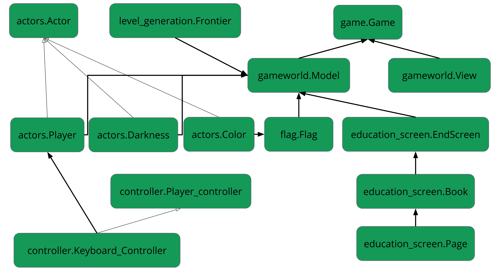

# Flag Quest
Flag Quest is a rogue like game created to spread
awareness of LGBTQ+ identities by integrating the elements
of LGBTQ+ flags into fun puzzles. As the game’s player, you
wander through the dark woods, navigating around or overcoming
obstacles to collect the different colors of your identity.
As you collect each color, you’ll learn more about the
history of the flag and the identity that it represents.


[](https://youtu.be/yAhY30pc9ok)

## Usage
For instructions on how to download, install, and get started with the game,
view the [README](https://sd19spring.github.io/FlagQuest/usage).

## Code
Architecture diagrom of how our various classes and modules interact.


Below is our code in the level_generation module for finding a path. 
It returns a valid path with a specified number of random stops
along the way. This keeps the path from being the shortest 
optimized path, but also makes it so the path is not completely random.

```python
def get_zigzag_path(grid_cells, start_cell, end_cell, num_stops):
    """Returns valid path with specified number of random stops along the way
    Includes start and end cells. (but if that turned out to be bad later, easy
    to change. Remove end cell here, remove start cell in get_valid_path)"""

    cells = [start_cell]
    for stop in list(range(num_stops)):
        random_cell = get_random_cell(grid_cells)
        cells.append(random_cell)
    cells.append(end_cell)

    path = []
    for i in list(range(num_stops + 1)):
        segment = get_valid_path(grid_cells, cells[i], cells[i+1])
        path.extend(segment)
    path.append(end_cell)

    return path
```

The code for finding a valid path (used by get_zig_zag):

```python
def get_valid_path(grid_cells, start_cell, end_cell):
    """Uses simple breadth-first pathfinding algorithm to generate path from one
    cell to another.
    Based on https://www.redblobgames.com/pathfinding/a-star/introduction.html
    Includes start cell but not end cell."""

    # sweep through all coordinates to get all paths to start
    frontier = Frontier(start_cell, grid_cells)
    came_from = {}
    came_from[start_cell] = None

    while end_cell not in frontier.members:     #goes until hits end cell
        current = frontier.members[0]
        for next in frontier.neighbors(current):
            if next not in came_from:
                frontier.put(next)
                came_from[next] = current
        del frontier.members[0]

    # trace back through sweep to find path
    current_check = end_cell
    path = []
    path_coords = []  #Not currently in use. For debugging purposes
    while current_check != start_cell:
       current_check.type = 'path'
       path.append(current_check)
       current_check = came_from[current_check]
       path_coords.append(current_check.label)

    path.reverse()
    path_coords.reverse()

    return path
```

### Obstacle visualization
The method below is used in our Model class, allowing the player to make obstacles disappear when they have the corresponding flag pieces. ```self.obstacles``` is a list used to place all obstacles on the map, so when an obstacle is removed from that list it no longer gets placed on the map.

```python
  def erase_obstacles(self, key = pygame.K_SPACE):
          """Removes obstacles from self.model.obstacles while spacebar is held"""
          if pygame.key.get_pressed()[key] == 1:
              for color in self.player.collided_with:   # iterates through list of colors that have been collided with
                  for group in self.obstacles:        # iterates through all groups of obstacles
                      if group.type == color.color:      # finds group that corresponds to color that was just touched
                          self.obstacles.remove(group)
                          self.cleared_obstacles.append(group)
          else:
              for group in self.cleared_obstacles:
                  self.cleared_obstacles.remove(group)
                  self.obstacles.append(group)
```
To talk about obstacles a little bit more, the draw_obstacle method uses a nifty little trick to make the obstacles look nice and pretty. Within the ```for obstacle in group``` loop, pygame makes a rectangle for each obstacle and fills it with that obstacle's assigned ```type``` color. The first box of code below shows how there are two different images (```image[1]``` and ```image[0]```) that are assigned based off of the obstacle's ```type``` values. That way, if the obstacle is a light-toned color it gets overlayed with a shadowed spike, whereas a dark-toned color gets overlayed with a highlighted spike

```python
    
    if type[0] > 200 or type[1] > 200 or type[2] > 200:      # overlays a shadow spike layer if the obstacle color is too bright
            self.image = pygame.transform.scale(image[1], self.size)
        else:                                                # overlays a highlight spike layer if obstacle color is dark enough
            self.image = pygame.transform.scale(image[0], self.size)
```
```python
    def draw_obstacles(self):
        """
        Draw the obstacles on the display

        Ideally the group.draw(self.screen) function would draw both the colored square and the obstacle.png overlay
        """
        for group in self.model.obstacles:       # places image of obstacle for each obstacle created in Model
            for obstacle in group:
                color = obstacle.type
                rectangle = pygame.Rect(obstacle.position, self.model.cell_size)
                pygame.draw.rect(self.screen, color, rectangle)     # drawns foundation square of the obstacle's color
            group.draw(self.screen)        # overlays the shaded "spike"
        self.model.erase_obstacles()        # runs method that allows player to erase colored obstacles by holding spacebar
```

## Project Evolution
Architecture Review 1
* General idea validated
* LGBT Representation
  * People were excited for representation
  * Talk to Rame - our Diversity and Inclusion Director
  * Do not make large generalizations
  * Careful about implementing real world challenges, do not want to trivialize them
  * Get more members of the LGBT+ community to test the game
* Education
  * Knowing what the colors mean
  * History of the flags and their purpose
  * Who made the flags
  * How to refer to people properly
  * Collecting flag colors is like piecing together pieces of identity which is rewarding
* Mechanics
  * Colors are “keys” for the walls
  * Collecting a color gives you a riddle or puzzle
  * Limited visibility

Architecture Review 2
* Aesthetics and Education
  * Changed endgame to a book style
    * Avoid too much information on a page
    * Also do not want to cut information out
    * Have resources to learn more
  * Should do a top down view
  * Characters should be as inclusive as possible
* Code Design
  * Suggestions on collision fixing (pixel perfect)
  * How to implement level generation
    * Generate three random points that you have to go through - this avoids having
    a totally perfect or totally random path

Other
* Added darkness to create puzzle like challenge

## Software Impact
A big aspect of this project was placing an emphasis on education and proper
representation of the LGBTQ+ community.

There is no perfect way to make sure that all groups were properly represented.
Due to the scope of this project, many groups and identities within the LGBTQ+
community could not be included. We worked with members of the Olin LGBTQ+
community to determine which identities seemed most important to include.

For the groups that are represented in the game, there is still potential for
misrepresentation and mitigation of historical struggles. We worked with Olin's
Director of Diversity and Inclusion & Title IX Coordinator as well as members of
the LGBTQ+ community to make the best effort towards proper representation.
However, these communities have deep and complicated histories and it is
impossible to represent them wholly.

Generally, we tried to air on the side of caution in regards to this project.
With our main goal being to raise awareness about this group and to encourage
the players to do further research.

## Accolades
Thank you to Gilbert Baker, Monica Helms, Michael Page, and all other
creators of the various LGBTQ+ flags that we based this game
around. Thank you to Rame Hanna and members of the Olin
LGBTQ+ community for help with representing groups of the LGBTQ+
community properly.

Thank you as well to all the people of the internet
and Olin community who contributed their thoughts and examples
for our learning. Special thanks to Dieter Brehm for letting us
analyze his random world generation code for inspiration. Thanks
to Arwen Sadler for letting us use their modified trans terminology
paper (Originally from TSER). Thanks to Alex Hindelang for creation
of our game's character.

We used a variety of online resources during the creation of our game, see more
[here](https://sd19spring.github.io/FlagQuest/resources).

## Authors
This game was created, designed, and coded by Lauren Anfenson,
David Freeman, Emma Mack, and Griffith Stites. See more about us and our
contributions [here](https://sd19spring.github.io/FlagQuest/about-us).
