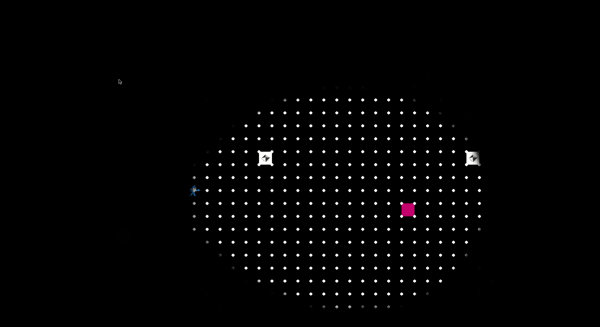
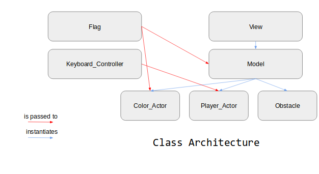
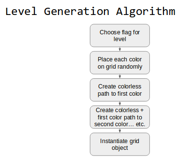

# Flag Quest
Flag Quest is a rogue like game created to spread
awareness of LGBTQ+ identities by integrating the elements
of LGBTQ+ flags into fun puzzles. As the game’s player, you
wander through the dark woods, navigating around or overcoming
obstacles to collect the different colors of your identity.
As you collect each color, you’ll learn more about the
history of the flag and the identity that it represents.



## Usage
For instructions on how to download, install, and get started with the game,
view the [README](https://sd19spring.github.io/FlagQuest/usage).

## Code




Our plan for level generation algorithm.

```python
  def get_open_squares(model):
      poss_directions = [(1, 0), (0, 1), (-1, 0), (0, -1), (1,1), (-1,1), (1,-1), (-1,-1)]
      for direction in poss_directions:
          model.grid_cells[model.player.grid_cell]
```

Level Generation method to find the open squares.

```python
  def get_open_squares(model):
      poss_directions = [(1, 0), (0, 1), (-1, 0), (0, -1), (1,1), (-1,1), (1,-1), (-1,-1)]
      for direction in poss_directions:
          model.grid_cells[model.player.grid_cell]
```

```python
  def rotate(self):
        """Rotates the darkness to match the player"""
        angle = self.player.cont.angle
        self.image = self.rotations[angle]      # overlay image of darkness that points in same direction as player

  def draw_position(self):
      """Finds the draw position for the darkness based on player position"""
      player_c = self.player.position_c
      if self.player.cont.angle%90 == 0: # if on 90 degree increments
          return (player_c[0]-self.size[0]/2, player_c[1]-self.size[1]/2)
      else: # if on 45 degree increments
          a = .21
          return (player_c[0]-self.size[0]/2-self.size[0]*a, player_c[1]-self.size[1]/2-self.size[1]*a)
```

## Project Evolution
TODO

"Tell an illustrative story about the process of creating your software, showing how it improved over time. This may draw upon what you learned from the two peer technical reviews and from the code review. Consider the use of screenshots or other tools to demonstrate how your project evolved."

## Software Impact
A big aspect of this project was placing an emphasis on education and proper
representation of the LGBTQ+ community.

There is no perfect way to make sure that all groups were properly represented.
Due to the scope of this project, many groups and identities within the LGBTQ+
community could not be included. We worked with members of the Olin LGBTQ+
community to determine which identities seemed most important to include.

For the groups that are represented in the game, there is still potential for
misrepresentation and mitigation of historical struggles. We worked with Olin's
Director of Diversity and Inclusion & Title IX Coordinator as well as members of
the LGBTQ+ community to make the best effort towards proper representation.
However, these communities have deep and complicated histories and it is
impossible to represent them wholly.

Generally, we tried to air on the side of caution in regards to this project.
With our main goal being to raise awareness about this group and to encourage
the players to do further research.

## Accolades
Thank you to Gilbert Baker, Monica Helms, Michael Page, and all other
creators of the various LGBTQ+ flags that we based this game
around. Thank you to Rame Hanna and members of the Olin
LGBTQ+ community for help with representing groups of the LGBTQ+
community properly.

Thank you as well to all the people of the internet
and Olin community who contributed their thoughts and examples
for our learning. Special thanks to Dieter Brehm for letting us
analyze his random world generation code for inspiration. Thanks
to Arwen Sadler for letting us use their modified trans terminology
paper (Originally from TSER).

We used a variety of online resources during the creation of our game, see more [here](https://sd19spring.github.io/FlagQuest/resources).

## Authors
This game was created, designed, and coded by Lauren Anfenson,
David Freeman, Emma Mack, and Griffith Stites.
