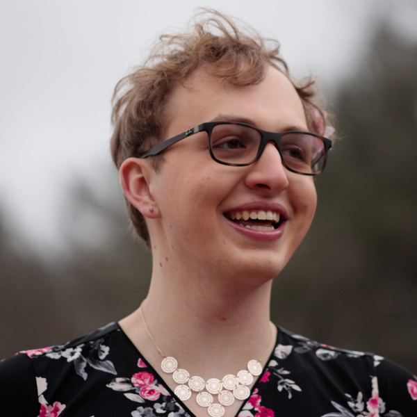
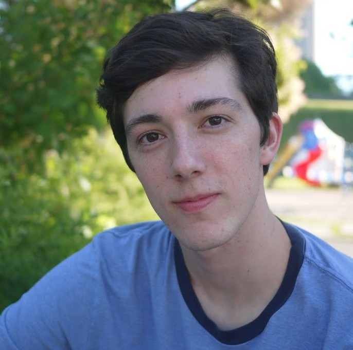

# About Us
We are a group of students at Olin College of Engineering students who worked on the Flag Quest project together for our Software Design Final Project.

## Griffith they/them

I am an Electrical and Computer Engineering major, class of 2022.

I was excited to work on this project because I am trans and I wanted to raise more awareness about the LGBT community. My main goal was to make the game spur interest in learning more about the LGBT community. I wanted to make sure the educational aspects in the game were approachable and enjoyable.

I am also an organization freak - I was jumping up and down since week one of the project about wanting to do code organization.

Major Contributions:
* Educational End Screen Books
  * Design, research, and text
  * Python Module
* Flashlight
* Controller Module
* Code organization
  * Restructuring into modules
  * Docstrings
  * Comment consistency
  * Variable consistency
* Website and Documentation

Visit my personal website: [griffithstites.com](https://www.griffithstites.com/)

## Lauren she/her

I'm an Electrical and Computer Engineering major in my second year. In this project I was most excited about diving deep into code architecture, exploring algorithms for level generation, and expanding my own knowledge of the meanings and histories of LGBT pride flags!

Major Contributions:

* Level generation
  * Obstacle generation from paths
  * Integrating level generation with the rest of the game
* Color Actor module
* Code architecture planning

## David he/him

I’m in the Class of 2021 and I am really drawn to creative, thoughtful experiences. It’s been wonderful for me to learn how to make creative stuff with a computer (i.e. Python programming). This project has served as a good opportunity to practice the creation of fun and expressive work within a team environment.

Major Contributions:

* Player actor
* Player movement
* Obstacle generation, visualization, and manipulation
* Obstacle and background visuals

## Emma she/her

I was enthusiastic about the potential that educational games have to remove the dreary stigma from learning. One of my main goals was to design the game to make it as inclusive to all identities as possible.

Major contributions:

* Playable level generation work
  * Path planning
  * Process flow
* Flag display module
* Flag images 
* Flag stripe collision

[Return to Home](https://sd19spring.github.io/FlagQuest/)
